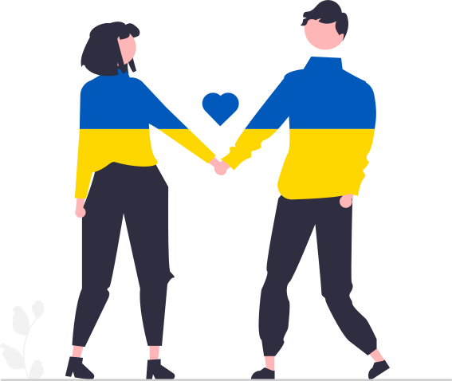

⚠️ This project has been discontinued ⚠️

---

   
   <h1>HostRefugees.eu</h1>

 

**Ukrainians need our help!** This is why we build the Open-Source platform [HostRefugees](https://hostrefugees.eu/) to bring free accommodations and refugees together.

Coming to Germany, the state-run reception centers provide a place to sleep, food, and other necessities. Due to the number of people arriving, it is only a short-term solution. Ukrainians may even have to leave their pets at an animal shelter because the receptions don't allow them there.

**We can do more!**

On HostRefugees.eu, hosts can offer their apartment or room to people and pets in need. Guests can search and find free places to stay, and the platform matches them with the host. Additionally, we provide important and valuable information for guests and hosts. For us, safety is the highest priority.

- **Safety Before Check-In**: Every person who wants to offer accommodations on the platform has to identify themselves with a valid ID document
- **Simple Process**: Automatic matching relieves the burden on helpers and helps refugees find a suitable accommodation more quickly. Contact details are only shared after a match to coordinate the check-in
- **Safety After Check-In**: The guest and host must perform a safety check after check-in to ensure the safety of both parties
- **Transparency**: The source code of the platform is publicly available on [Github](https://github.com/timokoenig/hostrefugees)([https://github.com/timokoenig/hostrefugees](https://github.com/timokoenig/hostrefugees))

## Documentation

- [Getting Started](./docs/getting-started.md)
- [Deployment](./docs/deployment.md)
- [i18n](./docs/i18n.md)

## Contributors

Special thanks to [Katerina Limpitsouni](https://twitter.com/ninaLimpi) and [undraw.co](https://undraw.co) for providing the illustrations for this project.

Thinking of contributing to this project but don't know where to start? Send me a message on Twitter <a href="https://twitter.com/timokoenig">@timokoenig</a>

---

Made with ♥ for the people

